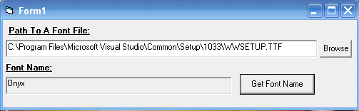



## Get Font Name From Font File \*Updated\*

### Description

Ever wanted to retrieve the font name from a font file that wasn't installed... It's pretty much impossible using plain api or vb, until now!! This code will get the font name from a font file even if it isnt installed! *Update* A fix has been added to account for unicode (double byte) font names - Thanks to soorya for the fix.
 
### More Info
 

             |
---                |---
**Submitted On**   |2007-12-11 13:48:16
**By**             |[Lewis Miller](https://github.com/Planet-Source-Code/PSCIndex/blob/master/ByAuthor/lewis-miller.md)
**Level**          |Intermediate
**User Rating**    |5.0 (10 globes from 2 users)
**Compatibility**  |VB 6\.0
**Category**       |[Miscellaneous](https://github.com/Planet-Source-Code/PSCIndex/blob/master/ByCategory/miscellaneous__1-1.md)
**World**          |[Visual Basic](https://github.com/Planet-Source-Code/PSCIndex/blob/master/ByWorld/visual-basic.md)
**Archive File**   |[Get\_Font\_N20934512112007\.zip](https://github.com/Planet-Source-Code/lewis-miller-get-font-name-from-font-file-updated__1-69737/archive/master.zip)

### API Declarations

3

